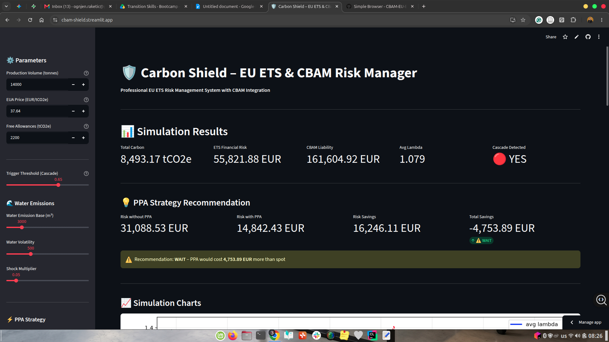
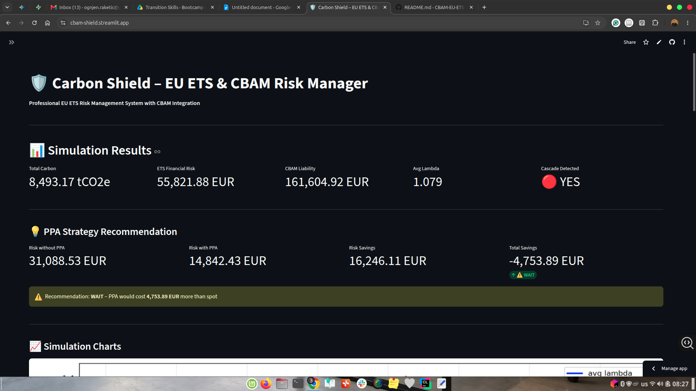
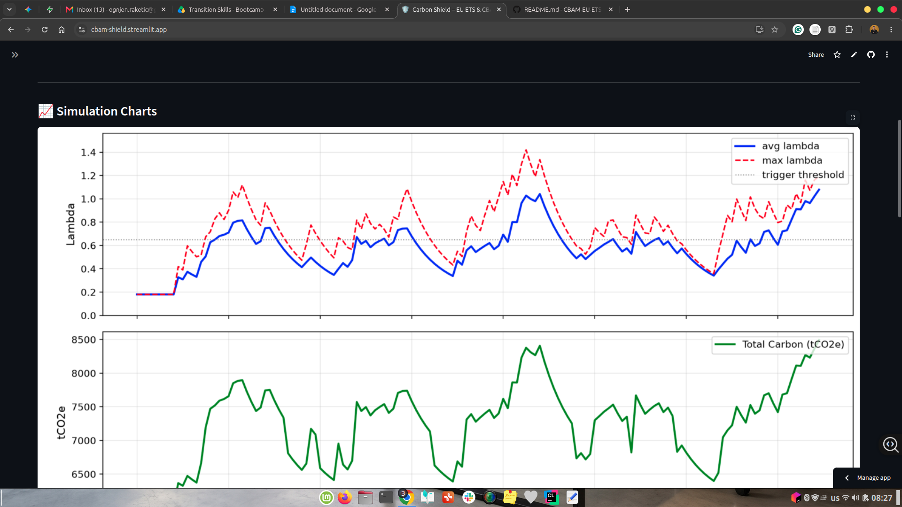
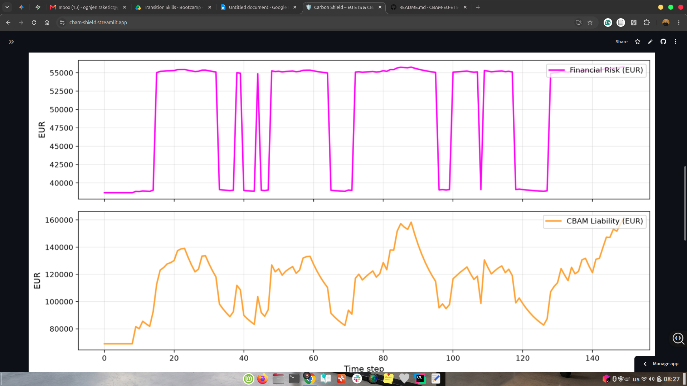
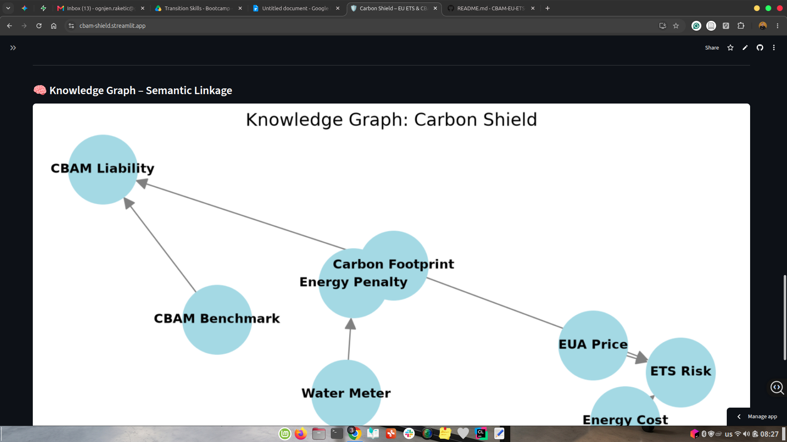
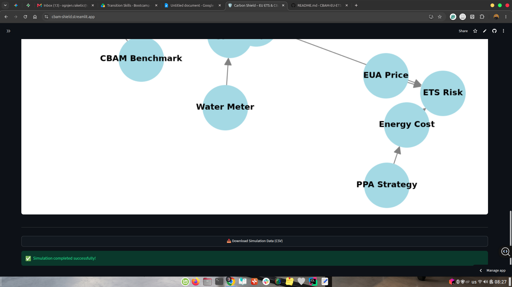

# 🛡️ Carbon Shield – EU ETS & CBAM Risk Manager

<div align="center">

**Professional Risk Management Tool for EU Emissions Trading System (ETS) & Carbon Border Adjustment Mechanism (CBAM)**

[](https://cbam-shield.streamlit.app/)
[](https://www.python.org/downloads/)
[](https://opensource.org/licenses/MIT)

</div>

---

## 📋 Overview

**Carbon Shield** is an interactive risk management dashboard that helps industrial manufacturers quantify and mitigate their **EU ETS financial exposure** and **CBAM (Carbon Border Adjustment Mechanism) liability**. Built for decision-makers in heavy industry, it combines:

- **Real-time EUA price feeds** (via Yahoo Finance)
- **Stochastic anomaly detection** (Alfa‑Pulse Kernel)
- **EU ETS compliance modeling** (Scope 1, Scope 2 emissions, financial risk)
- **CBAM liability calculation** (embedded emissions per tonne, benchmarking)
- **PPA (Power Purchase Agreement) strategy optimization**

> *"From sensor data to financial risk – in one dashboard."*

---

## 🎯 Key Features

| Feature | Description |
|---------|-------------|
| **Live EUA Price** | Auto-fetches current EU Allowance price from Yahoo Finance (KEUA/KRBN/CTWO) with 5-minute caching |
| **Stochastic Anomaly Detection** | Aramis Alfa‑Pulse Kernel detects operational anomalies in sensor data (water emissions, temperature, vibration) |
| **Cascade Alert System** | Flags when lambda exceeds the trigger threshold – early warning for cascading equipment failures |
| **EU ETS Risk Calculator** | Computes Scope 1 & Scope 2 emissions, total carbon footprint, and financial risk (EUR) based on EUA price and free allowances |
| **CBAM Liability Estimator** | Calculates embedded emissions per tonne, compares against EU benchmarks, and estimates CBAM liability |
| **PPA Strategy Optimizer** | Compares spot energy prices vs. PPA fixed prices and recommends "BUY" or "WAIT" with break-even analysis |
| **Scenario Analysis** | Runs optimistic, base, and pessimistic scenarios simultaneously |
| **Interactive Dashboard** | Streamlit-based UI with sliders, real-time metrics, and downloadable CSV reports |
| **Knowledge Graph** | Visualizes semantic linkages between operational, financial, and regulatory indicators |

---

## 🧠 How It Works

### 1. Anomaly Detection (Stochastic Kernel)
The **Aramis Alfa‑Pulse Kernel** processes real-time sensor data (simulated or live) and maintains running statistics (mean, variance). When sensor readings exceed a dynamic threshold (mean + σ × multiplier), the kernel triggers a "shock" that increases the `lambda` value. If `lambda` crosses the trigger threshold, a **cascade alert** is raised – indicating potential equipment failure risk.

### 2. ETS Compliance Engine
Using a linear input-output model (Leontief inverse), the engine calculates:
- **Scope 1** (direct emissions from owned sources)
- **Scope 2** (indirect emissions from purchased energy)
- **Total carbon footprint** (tCO2e)
- **Financial risk** = max(0, Scope1 – free_allowances) × EUA_price

### 3. CBAM Calculator
For a given product category (Steel, Cement, Aluminium, Fertilisers, etc.):
- **Embedded emissions** = total_carbon / production_volume
- **Excess emissions** = max(0, embedded – EU benchmark)
- **CBAM liability** = excess × production_volume × EUA_price

### 4. PPA Optimizer
Compares two scenarios:
- **Without PPA**: higher energy cost volatility, higher ETS risk
- **With PPA**: fixed energy price, lower risk
- **Recommendation**: BUY if total_savings (risk savings + energy cost savings) > 0

---

## 🚀 Quick Start

### Live Demo
👉 [Click here to launch the live app](https://cbam-shield.streamlit.app/)

### Run Locally

1. **Clone the repository**
   ```bash
   git clone https://github.com/virtus-flow/CBAM-EU-ETS-Shield
   cd carbon-shield-cbam

2. **Create Virtual environment** 
    ```bash
    python -m venv venv
    source venv/bin/activate   # On Windows: venv\Scripts\activate

3. **Install dependencies**
    ```bash
    pip install -r requirements.txt

4. **Run the app**
    ```bash
    streamlit run streamlit_app.py

5. Open http://localhost:8501 in your browser.

## 📁 Repository Structure

```bash
carbon-shield-cbam/
├── screenshots/
│   ├── dashboard.png
│   ├── results.png
│   └── knowledge_graph.png
├── streamlit_app.py
├── requirements.txt
└── README.md

## ⚙️ Configuration

   ```py
   CONFIG = {
    "kernel": {
        "n_components": 4,          # Number of monitored components
        "n_sensors": 10,            # Sensors per component
        "beta": 0.12,               # Mean reversion speed
        "mu": 0.18,                 # Baseline lambda
        "kick": 0.20,               # Shock amplitude
        "gamma": 0.15,              # Cross-component coupling
        "trigger_threshold": 0.65,  # Cascade alert threshold
        "reset_after": 30,          # Reset window
        "sigma_multiplier": 2.6     # Anomaly detection sensitivity
    },
    "cbam": {
        "benchmarks": {
            "Steel": 1.328,
            "Cement": 0.766,
            "Aluminium": 1.0,
            ...
        }
    }
}
```
## 🛠️ **Technologies**

| Technology | Purpose |
|------------|---------|
| **Python 3.10+** | Core language |
| **Streamlit** | Interactive dashboard UI |
| **NumPy / Pandas** | Data processing |
| **Matplotlib** | Visualization |
| **NetworkX** | Knowledge graph |
| **yfinance** | Live EUA price feed |
| **SciPy** | Numerical solvers (MLE calibration) |

## 📊 **Screenshots**








## 🔮 Roadmap

| Status | Feature |
|--------|---------|
| ✅ | Live EUA price feed (yfinance) |
| ✅ | Stochastic kernel with cascade alerts |
| ✅ | EU ETS risk calculator |
| ✅ | CBAM liability estimator |
| ✅ | PPA strategy optimizer |
| ✅ | Scenario analysis (3 scenarios) |
| ✅ | Knowledge graph visualization |
| ✅ | CSV export |
| ✅ | Streamlit interactive dashboard |
| 🔄 | MLE calibration (in progress) |
| 🔜 | Historical data upload (CSV) |
| 🔜 | Email alerts (EUA price thresholds) |
| 🔜 | Docker containerization |
| 🔜 | REST API wrapper (FastAPI) |

## 🤝 **Contributing**

Contributions are welcome! Please feel free to submit a Pull Request.

1. Fork the repository
2. Create your feature branch (git checkout -b feature/amazing-feature)
3. Commit your changes (git commit -m 'Add some amazing feature')
4. Push to the branch (git push origin feature/amazing-feature)
5. Open a Pull Request

## 📄 **License**

Distributed under the MIT License. See LICENSE file for more information.

## 📬 Contact

**Ognjen Raketić, M.Sc.**

- LinkedIn: [Ognjen Raketić](https://linkedin.com/in/ognjen-raketic)
- Email: [ognjen.raketic@gmail.com](mailto:ognjen.raketic@gmail.com)
- GitHub: [virtus-flow](https://github.com/virtus-flow)

---

## 🙏 Acknowledgments

- [Prof. Enrico Zio (Politecnico di Milano)](https://scholar.google.com/citations?hl=en&user=Fz_uKmYAAAAJ) – for supervising the research on stochastic reliability modeling
- [POLIMI Graduate School of Management – Skills for Transition Bootcamp](https://www.gsom.polimi.it/en/course/skills-for-transition/)
- [UniCredit Group](https://www.unicreditgroup.eu/en.html) – for funding the program


<div align="center"> <sub>Built with ❤️ for the green transition</sub> </div>


